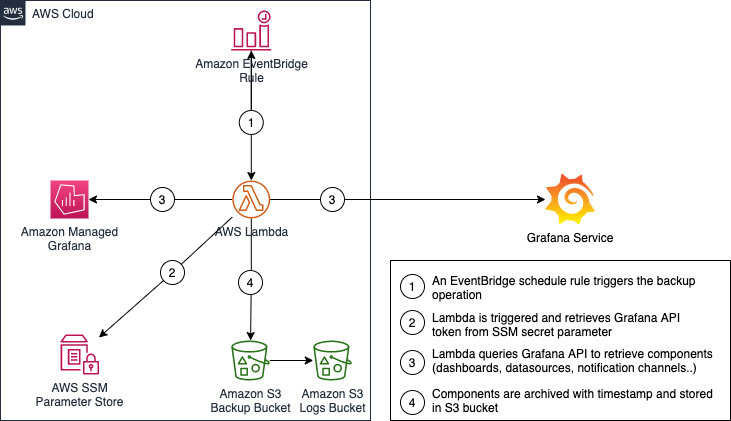

# Grafana Automated Backup Tool

A Serverless tool to automate Grafana components Backup and Restore.   

## Overview

This serverless application is based on the open source [Grafana Backup Tool](https://github.com/ysde/grafana-backup-tool).   
It packages an AWS Lambda function to schedule grafana backups and on demand grafana restore.    
The AWS Lambda function is triggered by an Amazon EventBridge schedule rule to backup grafana components (dashboards, datasources, alert channels..).
The restore operation is on demand.
The application also creates the backup Amazon S3 bucket and the Amazon EventBridge schedule rule to trigger the backup operation. 



## Installation instructions

### Requirements  

- AWS Account with Administrator permissions 
- Grafana [API Token](https://grafana.com/docs/grafana/v9.0/developers/http_api/auth/) that has admin access to your Grafana Workspace and stored in [AWS SSM Parameter Store](https://docs.aws.amazon.com/systems-manager/latest/userguide/systems-manager-parameter-store.html) as **SecureString**. 
- SAM CLI - [Install the SAM CLI](https://docs.aws.amazon.com/serverless-application-model/latest/developerguide/serverless-sam-cli-install.html)
- [Python 3.9 installed](https://www.python.org/downloads/)
- Docker - [Install Docker community edition](https://hub.docker.com/search/?type=edition&offering=community)

### Installation steps  

1. [Create an AWS account](https://portal.aws.amazon.com/gp/aws/developer/registration/index.html) if you do not already have one and login as Administrator.

2. Clone the repository:
```
git clone https://github.com/aws-samples/grafana-automated-backup-tool.git
```

3. Change into the repo's directory.
```
cd grafana-automated-backup-tool
```

4. Build the application locally with SAM CLI

```
sam build --use-container
```

5.	Deploy the SAM application with the following command:
```
sam deploy --guided
```

When prompted for parameters, enter:
- **Stack Name**: grafana-automated-backup
- **AWS Region**: your preferred AWS Region (e.g. us-east-1)
- **Parameter GrafanaUrl**: Your Grafana URL (without the / at the end. e.g. https://g-1234abcd.grafana-workspace.us-east-1.amazonaws.com).
- **Parameter BackupBucketName**: Your Backup Amazon S3 bucket name. Must be unique across all AWS accounts. 
- **Parameter BackupBucketPrefix**: Your Backup Prefix within Amazon S3 bucket. (default: grafana-backups). 
- **Parameter BackupSchedule**: Cron expression for the backup schedule. (default: cron(0 3 * * ? *) every day at 3:00am). 
- **Parameter GrafanaApiTokenParameter**: The AWS SSM secret Parameter name for the Grafana API Token. (e.g. /grafana/api_token). 
- **Parameter LogLevel**: The backup AWS Lambda function log level. (default: INFO). 
- Accept all other defaults.


6.	After the deployment completes, the new Lambda function **grafana-backup-restore** is available and scheduled to perform backups automatically. It can also be invoked manually to run backup and restore on-demand operations.  


## Solution usage

Once the serverless application deployed, the backup AWS Lambda function **grafana-backup-restore** will be scheduled to run backup operations automatically.  
The backup archives can be found in the Backup Amazon S3 Bucket.  
This function can be invoked to perform on demand backup and restore operations as well. 
To perform on-demand operations, follow the instructions below:

1. Go to AWS Lambda console. 

2. Click on Backup function name **grafana-backup-restore** 

3. Under **Test** select **Create new event**.

4. For example, to restore the latest backup into your Grafana workspace create a new event called **restore_latest** 

5. Under event JSON paste the following payload 
```json
{
    "operation": "restore"
}
```

6. Click on **Test**  

For more operations, you can create custom events using the following parameters: 

### Parameters 

| Parameter  |  Description |  default |
|---|---|---|
| operation | Lambda operation (backup or restore) | backup | 
| components | optional parameter used with restore to choose components to restore | folders,dashboards,datasources,alert-channels |   
| backup_file | optional parameter to specify backup file for restore (only the filename 123456.tar.gz) | latest available backup in the bucket |   

### Sample Lambda events  

#### Backup 
```json
{
    "operation": "backup"
}
```

#### Backup specific components
```json
{
    "operation": "backup",
    "components": "dashboards,datasources"
}
```

#### Restore all grafana components with the latest backup
```json
{
    "operation": "restore"
}
```

#### Restore all grafana components with a secific backup file
```json
{
    "operation": "restore",
    "backup_file": "202211131323.tar.gz"
}
```

#### Restore dashboards and datasources only with a secific backup file
```json
{
    "operation": "restore",
    "components": "dashboards,datasources"
    "backup_file": "202211131323.tar.gz"
}
``` 

## Cleanup  

To delete the sample application that you created, use the AWS CLI. Assuming you used **grafana-automated-backup** for the stack name, you can run the following: 
```
aws cloudformation delete-stack --stack-name grafana-automated-backup
```

## Security  

This SAM application is implemented with the following security best practices:
- With the principle of least privilege, you grant permissions to only the resources or actions that users need to perform tasks.
- Amazon S3 buckets are deployed with security compliance rules: encryption, versioning, and blocking public access.
- Amazon S3 buckets enforce HTTPS/TLS secure connections for data transfer with a bucket policy.
- The Amazon S3 Backup bucket access is logged in a separate access logging Amazon S3 bucket for audit purposes.
- Grafana API token must be stored as a Secure String in AWS Systems Manager Parameter Store.

See [CONTRIBUTING](CONTRIBUTING.md) for more information.

## License

This library is licensed under the MIT-0 License. See the [LICENSE](LICENSE) file.